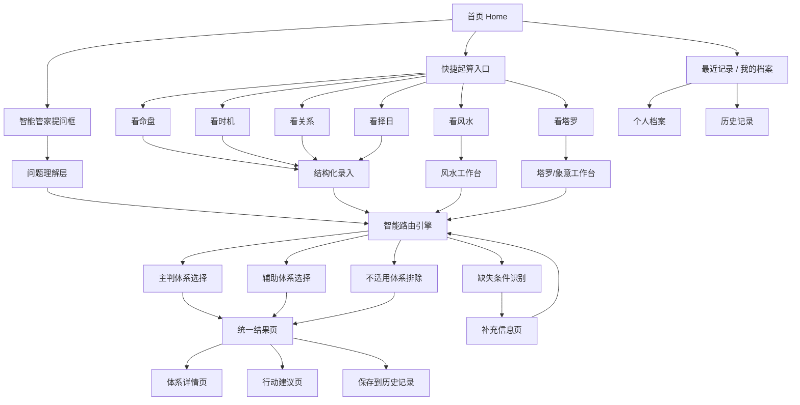

# 玄学系统小程序 V1 架构图与页面清单

## 产品定位

- 目标：把系统做成一个人人都能上手的玄学智能管家，让用户在手机上直接提问，系统自动分配合适的玄学体系参与回答。
- 定位：不是单纯的玄学展示页，而是“可提问、可起算、可复盘、可持续使用”的个人玄学工作台。
- 体验原则：先提问，后分配；先答案，后术语；先行动建议，后体系展开。

## 核心判断

- 首页主入口必须是“智能管家提问框”。
- 分类入口有必要，但不是强制分流，而是辅助性的“快捷起算入口”。
- 用户不需要先判断自己该用哪门术，系统负责路由。
- 用户需要的是：我问一个真实问题，系统告诉我这次该由哪些体系来回答，为什么这么分配，还差什么信息。

## 信息架构

## 页面清单

### 1. 首页
- 目标：让用户一打开就愿意开口提问。
- 主体：智能管家提问框。
- 辅助：快捷起算入口、最近记录、常用问题模板。
- 重点：首页不要求用户先懂分类。

### 2. 智能管家页
- 目标：把自然语言问题翻译成可起算任务。
- 内容：提问、系统回话、补问、条件确认、推荐参与体系。
- 重点：它是一个会分配任务的“管家”，不是静态输入框。

### 3. 快捷起算页
- 目标：给高频用户和目标明确的用户更快入口。
- 入口：看命盘、看风水、看时机、看关系、看择日、看塔罗。
- 重点：它是快捷通道，不是强制分类。

### 4. 结构化录入页
- 目标：把必要条件补齐，让系统能稳定起算。
- 内容：出生信息、地点、时间、问题范围、候选日期、图像上传等。
- 重点：字段按本轮被选中的体系动态变化。

### 5. 风水工作台
- 目标：真正实现“人人都能在手机上自己看风水”。
- 内容：地址、朝向、户型图上传、空间标注、关键点位选择。
- 重点：一边录入，一边给空间判断和优化建议。

### 6. 塔罗/象意工作台
- 目标：保留最强神秘感交互，同时服务起算。
- 内容：牌阵选择、洗牌、翻牌、牌位说明、自动写回问题。
- 重点：是起算工具，不是独立装饰页。

### 7. 智能路由确认页
- 目标：让用户知道系统为什么调用这些体系。
- 内容：主判体系、辅助体系、缺失条件、不建议采用的体系、可信度提示。
- 重点：增强专业感和透明度。

### 8. 补充信息页
- 目标：当信息不足时，不让用户失败退出，而是继续完成起算。
- 内容：系统追问、缺失字段、建议补法。
- 重点：像对话，不像报错。

### 9. 统一结果页
- 目标：先交付结论，再说明依据，再给行动建议。
- 内容：一句话结论、原因拆解、行动建议、风险提醒、参与体系标签。
- 重点：这是主结果页，不是论文页。

### 10. 体系详情页
- 目标：给进阶用户深挖。
- 内容：单体系展开结果、盘面结构、辅助解释。
- 重点：默认折叠，不压住主结论。

### 11. 历史记录页
- 目标：形成复盘与持续使用价值。
- 内容：问题、时间、结论摘要、参与体系、再次查看。
- 重点：支持同问题多次补问和多轮结果。

### 12. 个人档案页
- 目标：让系统越来越懂用户。
- 内容：出生信息、常住城市、常问主题、偏好体系、风水常用地址。
- 重点：一次填写，多次复用。

## 核心页面流程

### A. 智能管家主流程

1. 用户在首页直接输入自然语言问题。
2. 智能管家判断问题类型、缺失条件、适用体系。
3. 如果信息足够，直接进入起算。
4. 如果信息不足，进入补充信息页。
5. 系统输出“本轮由哪些体系回答、为什么这样分配”。
6. 输出统一结果页。
7. 用户按需展开单体系详情，或保存到历史记录。

### B. 快捷起算流程

1. 用户点击快捷入口，如“看风水”。
2. 系统进入对应专项工作台。
3. 用户完成结构化输入。
4. 系统仍然经过智能路由层，不是绕过管家。
5. 输出统一结果页。

### C. 风水专项流程

1. 进入风水工作台。
2. 选择住宅 / 办公室 / 店铺。
3. 输入城市或地址。
4. 录入朝向，上传户型图或示意图。
5. 标记大门、卧室、灶位、办公桌、收银台等关键点位。
6. 系统输出：整体格局判断、风险点、调整点、优先级建议。
7. 用户可继续调整点位并复看结果。

### D. 命盘专项流程

1. 用户提问或点击“看命盘”。
2. 系统要求补齐出生日期、时辰、地点、性别。
3. 系统根据问题重点自动调用八字、紫微、西占、吠陀、人类图等体系。
4. 输出统一结论，再展开多体系细节。

### E. 塔罗专项流程

1. 用户点击“看塔罗”或在提问中明确要求塔罗。
2. 进入牌阵选择与翻牌流程。
3. 牌面结果自动写回管家问题区。
4. 系统结合塔罗和象意层继续输出结果。

## 页面状态要求

- 首次使用：减少字段，先建立信心。
- 回访用户：优先展示最近问题、常用入口、历史档案。
- 信息不足：给追问，不给冷报错。
- 不适合直算：明确标记“象意参考”或“需补资料后可直算”。
- 高风险问题：必须做边界提示，不给绝对承诺。

## 小程序 UI 原则

- 顶部永远简洁：一句标题，一句引导，不放大段说明。
- 中部永远是任务面：提问、补问、录入、上传、结果。
- 底部永远有下一步：继续问、补信息、展开体系、保存记录。
- 神秘感来自材质、光感、层次、节奏，不靠堆满图腾。

## 推荐底栏

- 首页
- 管家
- 风水
- 记录
- 我的

## 视觉方向

- 主色：墨黑、黛青、暗金、少量玉色高光。
- 材质：雾面玻璃、暗金细线、纸本纹理、星图刻痕。
- 动效：呼吸光、细星轨、卡片浮起、轻烟雾。
- 禁忌：廉价霓虹紫、满屏符咒、海报式大字堆砌、过重舞台感。

## V1 优先级

1. 首页
2. 智能管家页
3. 补充信息页
4. 风水工作台
5. 统一结果页
6. 历史记录页

## 本阶段改造重点

- 从“先分类再提问”改成“先提问，智能分配体系”。
- 从“体系展示型 UI”改成“智能管家 + 答案交付型 UI”。
- 从“Web 概念演出”改成“小程序轻仪式工作台”。
